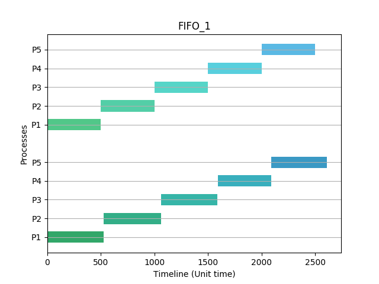
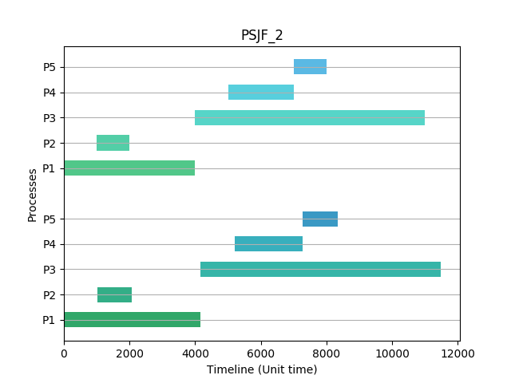
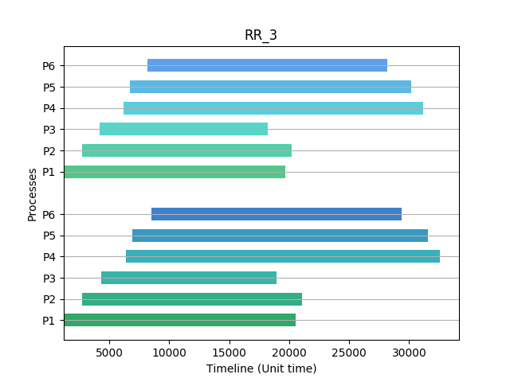
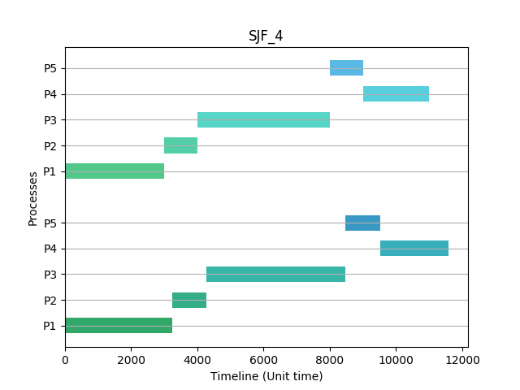

# Operating System - Project 1

###### By: Wu-Jun Pei (B06902029)

## 1. Environment

- VM Environment: <u>VirtualBox</u>
    - CPU: 2
    - RAM: 4GB
- OS: <u>Ubuntu 16.04</u>
- Kernel Version: <u>Linux-4.14.25</u>

## 2. Design

### Scheduler

##### <u>整體架構</u>

我將四個 policy 分開寫成四個 function。雖然寫成四個分開 function，但有依循一定的流程，如下：

```python
while True:
	1. 將所有 ready 的 process 加進 queue / priority queue
		- 在此時 create process 並將 block 他 (實作再 process.c 中)
	2. 若正在跑的 process 需要被暫停 (preemptive)，則將他暫停。
		- 使用 blockProcess 的 function
	3. 若現在沒有 process 正在執行，則從 queue / priority queue 取出一個 process 執行
		- 使用 wakeProcess 的 function
	4. 執行一個 unit time
	5. 檢查當前 process 是否完成，若完成則將 process
    	- 使用 waitpid 回收 pid
	6. 檢查是否所有 process 都執行完成，若是則結束
```

##### <u>實作細節</u>

- Utility
    - 實作 `UNIT`、`ELAPSE` 兩個 function 計算時間。
    - 實作一個 **Queue** 並提供 `push`、`pop`、`front` 的 method
    - 實作一個 **Priority Queue** 並提供 `push`、`pop`、`top` 的 method

- Process
  
    - Process 的 structure
    
        ```c
    struct Process {
            char name[40];
            int readyTime, executionTime;
            pid_t pid;
        };
        ```
        
    - 所有與 process 相關的 function，如 `assignCPU`、`blockProcess`、`wakeProcess`、`startProcess`。
    
    - `assignCPU`：將 parent process 指派到 CPU0，並將 child process 指派到 CPU1
    
    - block / wake 的方式是使用 `sched_setscheduler` 的方式，設定 `SCHED_FIFO` 的 policy 並設定 1 / 99 的 priority。
    
- Main
  
  - 排序所有的 process，按照以下方式：
      - ReadyTime，由小到大
          - ProcessName，字典序由小到大
  - 根據不同的 scheduling policy，使用不同的 policy function
  
- FIFO

  - 使用一個 Queue 維護所有 ready processes
  - 每跑完一個 Process 才找下一個 process 執行

- RR

    - 使用一個 Queue 維護所有 ready processes
    - 設定一個變數 `TTL` 紀錄當下在跑的 process 還有多少時間會被切換。當 `TTL` 為零時，將 process 暫停並重新加入 ready queue，再從 ready queue 找下一個 process。

-  SJF

    - 使用一個 Priority Queue 維護所有 ready processes
    - 每跑完一個 Process，找一個 execution time 最小的 process 執行

- PSJF

    - 使用一個 Priority Queue 維護所有 ready processes
    - 每個 unit time 結束後，檢查是否有 execution time 更小的 process。若有，切換到該 process 執行。

### System Call

- `kernel/Makefile`：加上

    ```makefile
    obj-y += my_printk.o
    obj-y += my_gettime.o
    ```

- `include/linux/syscall_64.h`：加上以下兩行

    ```c
    asmlinkage void sys_my_printk(char *s);
    asmlinkage void sys_my_gettime(struct timespec *ts);
    ```

- `arch/x86/entry/syscalls/syscall_64.tbl`：加上

    ```
    333     common  my_printk               sys_my_printk
    334     common  my_gettime              sys_my_gettime
    ```

- `kernel/my_printk.c`

    ```c
    #include <linux/kernel.h>
    #include <linux/linkage.h>
    
    asmlinkage void sys_my_printk(char *s){
        printk(s);
        return;
    }
    ```

- `kernel/my_gettime.c`

    ```c
    #include <linux/kernel.h>
    #include <linux/linkage.h>
    #include <linux/timer.h>
    
    asmlinkage void sys_my_gettime(struct timespec *ts){
        getnstimeofday(&ts);
        return;
    }
    ```

## 3. Result

### Theoretical Outcome

我使用一個 python3 的程式計算一個 input 的 theoretical output，結果以 unit time 為單位。

```bash
python3 evaluation/theoretical.py
```

### Error Calculation

首先，先將執行結果轉換成以 unit time 為單位，並使用以下兩種方式定義一個 Process 的執行誤差。

- Absolute Error (單位為 unit time)
    $$
    \begin{align*}
    \text{Absolute Error} =
    &|\text{Theo. Start Time} - \text{Outcome End Time}| + \\
    &|\text{Theo. End Time} - \text{Outcome End Time}|
    
    
    \end{align*}
    $$
    
- Relative Error (單位為百分比 %)
    $$
    \text{Relative Error} = \frac{\text{Absolute Error}}{\text{Theo. End Time}} \times 100\%
    $$

**實作**

- 我寫一個 python3 的程式計算時間誤差。

    ```bash
    python3 evaluation/diff.py POLICY_ID
    ```

- 此外，我也寫一個 python3 的程式畫出 timeline。

    ```bash
    python3 evaluation/diff-show.py POLICY_ID
    ```

#### <u>實際結果比較</u>

以下展示四個 demo 的 testcase 的結果：

<p style="page-break-after: always"></p>
##### <u>FIFO_1</u>

**Proess 第一次被 CPU 排程到的時間、結束時間表格**

| Name | Theo. Start Time | Theo. End Time | Real Start Time | Real End Time |
| :--: | :--------------: | :------------: | :-------------: | :-----------: |
| P1 | 0.00000 | 500.00000 | 0.00000 | 526.31091 |
| P2 | 500.00000 | 1000.00000 | 527.42677 | 1058.60335 |
| P3 | 1000.00000 | 1500.00000 | 1060.32034 | 1588.90728 |
| P4 | 1500.00000 | 2000.00000 | 1589.15729 | 2088.42533 |
| P5 | 2000.00000 | 2500.00000 | 2088.64196 | 2610.68563 |
**作圖**



> 表格上半部為理論時間；下半部為實際時間

**結果說明**

1. 所有的 Process 執行順序、開始時間、結束時間都符合理論值
2. 實際執行起來略比理論值慢一點點
3. 相對誤差：約 8.13319 %

<p style="page-break-after: always"></p>

##### <u>PSJF_2</u>

**Proess 第一次被 CPU 排程到的時間、結束時間表格**

| Name | Theo. Start Time | Theo. End Time | Real Start Time | Real End Time |
| :--: | :--------------: | :------------: | :-------------: | :-----------: |
| P1 | 0.00000 | 4000.00000 | 0.00000 | 4157.88830 |
| P2 | 1000.00000 | 2000.00000 | 1023.08203 | 2058.34835 |
| P3 | 4000.00000 | 11000.00000 | 4158.74988 | 11487.01499 |
| P4 | 5000.00000 | 7000.00000 | 5200.76232 | 7279.89572 |
| P5 | 7000.00000 | 8000.00000 | 7280.21392 | 8339.41034 |
**作圖**



> 表格上半部為理論時間；下半部為實際時間

**結果說明**

1. 所有的 Process 執行順序、開始時間、結束時間都符合理論值
2. 實際執行起來略比理論值慢一點點
3. 相對誤差：約 5.70023 %

<p style="page-break-after: always"></p>

##### <u>RR_3</u>

**Proess 第一次被 CPU 排程到的時間、結束時間表格**

| Name | Theo. Start Time | Theo. End Time | Real Start Time | Real End Time |
| :--: | :--------------: | :------------: | :-------------: | :-----------: |
| P1 | 1200.00000 | 19700.00000 | 1200.00001 | 20517.78023 |
| P2 | 2700.00000 | 20200.00000 | 2730.38518 | 21062.99559 |
| P3 | 4200.00000 | 18200.00000 | 4323.09876 | 18956.66711 |
| P4 | 6200.00000 | 31200.00000 | 6413.78382 | 32593.31699 |
| P5 | 6700.00000 | 30200.00000 | 6907.04945 | 31539.50763 |
| P6 | 8200.00000 | 28200.00000 | 8478.53302 | 29392.42141 |
**作圖**



> 表格上半部為理論時間；下半部為實際時間

**結果說明**

1. 所有的 Process 執行順序、開始時間、結束時間都符合理論值
2. 實際執行起來略比理論值慢一點點
3. 相對誤差：約 4.81598 %

<p style="page-break-after: always"></p>
##### <u>SJF_4</u>

**Proess 第一次被 CPU 排程到的時間、結束時間表格**

| Name | Theo. Start Time | Theo. End Time | Real Start Time | Real End Time |
| :--: | :--------------: | :------------: | :-------------: | :-----------: |
| P1 | 0.00000 | 3000.00000 | 0.00000 | 3232.67896 |
| P2 | 3000.00000 | 4000.00000 | 3240.60059 | 4259.95591 |
| P3 | 4000.00000 | 8000.00000 | 4274.54613 | 8463.12474 |
| P4 | 9000.00000 | 11000.00000 | 9518.56327 | 11593.14746 |
| P5 | 8000.00000 | 9000.00000 | 8463.43757 | 9518.33241 |
**作圖**



> 表格上半部為理論時間；下半部為實際時間

**結果說明**

1. 所有的 Process 執行順序、開始時間、結束時間都符合理論值
2. 實際執行起來略比理論值慢一點點
3. 相對誤差：約 10.10116 %

<p style="page-break-after: always"></p>

### Full Error Table

| Testcase | Absolute Error (UT) | Relative Error (%) |
| :------: | :------------: | :----------------: |
| FIFO_1 | 127.69577 | 8.13319 |
| FIFO_2 | 8143.16738 | 9.56557 |
| FIFO_3 | 1275.73914 | 7.54962 |
| FIFO_4 | 173.28525 | 6.43510 |
| FIFO_5 | 1301.64695 | 7.66673 |
| RR_1 | 135.32958 | 8.51449 |
| RR_2 | 338.29045 | 3.81558 |
| RR_3 | 1202.58987 | 4.81598 |
| RR_4 | 612.59579 | 4.69308 |
| RR_5 | 730.32608 | 5.44707 |
| SJF_1 | 457.80325 | 6.80839 |
| SJF_2 | 332.43569 | 3.85704 |
| SJF_3 | 902.68048 | 6.90968 |
| SJF_4 | 712.87741 | 10.10116 |
| SJF_5 | 194.91276 | 6.73422 |
| PSJF_1 | 693.88752 | 5.11107 |
| PSJF_2 | 397.07317 | 5.70023 |
| PSJF_3 | 121.29800 | 6.13651 |
| PSJF_4 | 409.12595 | 5.92006 |
| PSJF_5 | 361.05304 | 3.67889 |
| **Overall** | **931.19068** | **6.37968** |

### Conclusion & Discussion

1. 此次 Project 實作的 scheduler 基本上是符合理論上的順序及執行時間的
2. 做出來的結果中可以發現大部分的 process 都比較晚開始，且比較晚結束。我的推測是因為使用 `TIME_MEASUREMENT` 所計算的 UNIT TIME 是比較快的（可能因為排程的 testcase 比較簡單），而到比較複雜一點的 scheduling policy 因為判斷條件較多，而會有誤差。
3. 除了上述問題外，因為我的實作方式使用兩個核心，且我的 VM 只有兩個核心。實驗發現只要有其他 Process 正在執行將造成時間誤差增大，如 `sshd`、`tmux`、`htop` 等會干擾 schduler、process 的執行，會導致誤差最多到 33%。上面 output 的結果是重新開機後，直接跑以上 testcase 所得到的結果。